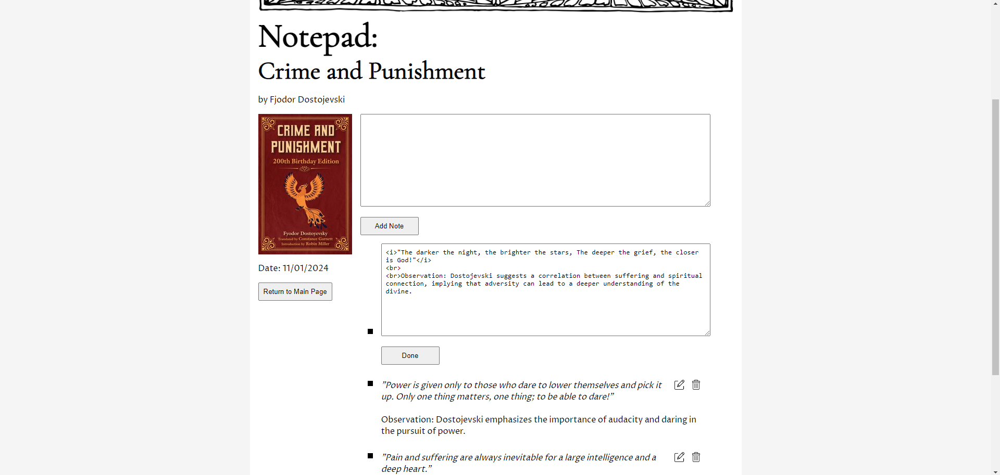

# Reader's Logbook
This is a capstone project for a Udemy course called The Complete Web Development Bootcamp 2023 (by The App Brewery).

> ## Project Instructions
>
> ### Overview
> *"I read a lot of books but after I finish reading them I often don't remember all the most salient parts of the book. So I started taking notes. This capstone project is built on this idea. My friend Derek Sivers has this fantastic website where he has all the non-fiction books he has read, his notes, his ratings and when he read them. The books are sortable by rating, recency and title. It's a such cool idea for a project so I'm including it as a capstone here in this course."*
>
> ### Objectives
> * Revise how to integrate public APIs into web projects.
>
> * Gain more experience using Express/Node.js for server-side programming.
>
> * Demonstrate ability to Create Read Update and Delete data in a PostgreSQL Database to persist data.

## Project Execution

The application was built with Express.js for server-side functionality, EJS for frontend rendering, and PostgreSQL for data persistence.

### Features

* **Book Listing:** Display a list of books you have read.
* **Sorting:** Sort books based on title, date read, or rating.
* **Adding New Entries:** Add new book entries with details such as ISBN, title, author, description, review, and rating.
* **Review Update:** Update book reviews.
* **Book Deletion:** Delete books along with associated notes.
* **Notes:** View, add, update and delete notes for each book.

#### Express Server Setup
* The server setup is implemented using Express.js, and the configuration is defined in the index.js file.
* Dependencies include express, body-parser, axios, pg, dotenv and ejs. Make sure to install these before running the application.
  * [Express.js](https://expressjs.com/)
  * [Body-parser](https://www.npmjs.com/package/body-parser)
  * [Axios](https://axios-http.com/)
  * [pg (PostgreSQL client)](https://node-postgres.com/)
  * [dotenv](https://www.npmjs.com/package/dotenv)
  * [EJS](https://www.npmjs.com/package/ejs)

#### API Interaction
* When submitting a new book entry, cover images are fetched from the [Open Library Covers API](https://openlibrary.org/dev/docs/api/covers) using Axios. A `fetchAndSaveCover` function fetches the images and saves them to the project folder.
* Other book details are fetched from the [Open Library Search API](https://openlibrary.org/dev/docs/api/search) as JSON files using an XMLHttpRequest. A search field has already been put in on top of the new entry form. A change in the input value of this field triggers the XMLHttpRequest function. The response data could be used to implement an autocomplete feature for the search field. This feature will be left for possible future development.

#### Frontend Rendering
* EJS files with HTML are utilized for dynamic frontend rendering, handling the display of book details, cover images, and notes. Additionally, CSS is used for styling, layout and responsiveness.

#### Data Persistence
* A PostgreSQL database created with pgAdmin is used for data persistence.
* Two tables, 'books' and 'notes', store book details and user-generated notes for each book.
* Book cover images are saved to the project folder by creating a writable stream with `fs.createWriteStream` and transferring the image data received from the Covers API using the piping method. Additionally, a file path for the cover image is saved to the 'books' table in the database.

#### Possible Future Development
* Animated star rating
* Autocomplete feature for populating the new entry form with book details

## How to Run Locally

1. **Clone this repository.**
   
2. **Navigate to the project directory.**
   
3. **Install dependencies using `npm install`.**
   
4. **Create a database with pgAdmin and tables 'books' and 'notes' with appropriate columns:**
   * **books table:**
     * id (primary key)
     * isbn
     * title
     * author
     * description
     * review
     * rating
     * image_path
     * date_read

   * **notes table:**
     * id (primary key)
     * note
     * book_id (foreign key referencing books.id)

5. **Create a .env file in your project directory with your database connection details:**
   ```env
   DB_USER="your_username"
   DB_HOST="your_host_address"
   DB_DATABASE="your_database_name"
   DB_PASSWORD="your_password"
   DB_PORT="your_database_port"

6. **Start the server using `npm start`.**

7. **Access the website in your browser at `http://localhost:3000`.**

## Screenshots

1. **Header of the page and the sort dropdown menu**


2. **Book entries with `View Notes`, `Delete Book` and `Update Review` features**


3. **New logbook entry form**


4. **Notepad with notes listing and `Add Note`, `Update Note` and `Delete Note` features**


